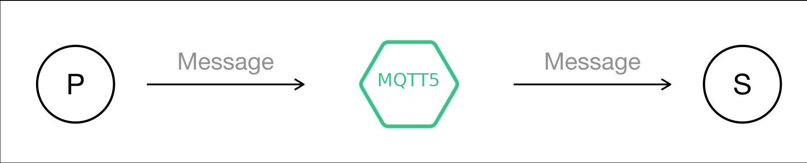
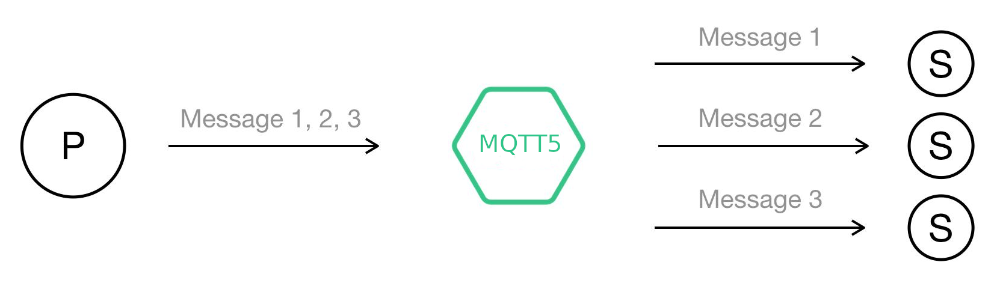

= Spring Boot Camel PAHO MQTT5 Shared subscription Quickstart

This quickstart demostrates how to set up multiple mqtt5 consumers that use shared subscription feature of mqtt5 in order to balance the load across the consumers.

=== MQTT 5.0 protocol introduction-shared subscription
Shared subscription is a new feature introduced by MQTT 5.0 protocol, which is equivalent to the load balancing function of the subscribers.

We know that the general non-shared subscription message publishing process is like this:

[#img-nonshared]

Under this structure, if the subscription node fails, it will cause the publisher's message to be lost (QoS 0) or accumulate in the server (QoS 1, 2). Under normal circumstances, the solution to this problem is to directly increase the subscription node, but this generates a large number of duplicate messages, not only wasting performance, in some business scenarios, the subscription node also needs to remove itself, further increasing the the complexity.

Secondly, when the publisher's production capacity is strong, there may be a situation where the subscriber's consumption capacity cannot keep up in time. At this time, the subscriber can only solve it by implementing load balancing, which again increases the user's development cost.

=== Protocol specification
Now, in the MQTT 5.0 protocol, you can solve the problems mentioned above through the shared subscription feature. When you use a shared subscription, the flow of messages becomes:

[#img-nonshared]

Like non-shared subscriptions, shared subscriptions include a topic filter and subscription options, the only difference is that the topic filter format for shared subscriptions must be in this form *$share/{ShareName}/{filter}*. The meanings of these fields are:

* *$share* The prefix indicates that this will be a shared subscription
* *{ShareName}* It is a string that does not contain "/", "+" and "#". Subscribe to the session by using the same *{ShareName}* Indicates sharing the same subscription, and messages matching the subscription will only be published to one of the sessions at a time
* *{filter}* Is the topic filter in non-shared subscriptions

It should be noted that if the server is sending a QoS 2 message to the selected subscriber, and the network is interrupted before the distribution is completed, the server will continue to complete the distribution of the message when the subscriber reconnects. If the subscriber's session is terminated before it reconnects, the server will discard the message without attempting to send it to other subscribers. If it is a QoS 1 message, the server can wait for the subscriber to reconnect and continue to complete the distribution, or it can immediately try to distribute the message to other subscribers when the subscriber disconnects. The MQTT protocol does not mandate it. It depends on the specific implementation. However, if its session is terminated while waiting for the subscriber to reconnect, the server will try to send the message to other subscribers.

== Run the Quickstart

This quickstart use a public MQTT 5 test server available at the time of writing.
It contains one producer and six consumers that are part of the same conversation group (group1)

. Build the project
+
....
 mvn clean package
....

. Start the fat jar
+
....
 mvn spring-boot:run
....
+
In the logs, you should see something like this:
+
....
2021-06-10 10:12:28.397  INFO 139306 --- [           main] o.a.camel.spring.SpringCamelContext      : Total 7 routes, of which 7 are started
2021-06-10 10:12:28.399  INFO 139306 --- [           main] o.a.camel.spring.SpringCamelContext      : Apache Camel 2.23.2.fuse-790045 (CamelContext: camel-1) started in 6.482 seconds
2021-06-10 10:12:28.414  INFO 139306 --- [           main] c.r.l.example.paho.mqtt5.Application     : Started Application in 7.442 seconds (JVM running for 7.619)
2021-06-10 10:12:29.415  INFO 139306 --- [1 - timer://foo] producer                                 : PRODUCER   - MESSAGE: 0 - hello world
2021-06-10 10:12:29.619  INFO 139306 --- [Call: consumerB] consumerB                                : CONSUMER B - MESSAGE: 0 - hello world
2021-06-10 10:12:34.396  INFO 139306 --- [1 - timer://foo] producer                                 : PRODUCER   - MESSAGE: 1 - hello world
2021-06-10 10:12:34.590  INFO 139306 --- [Call: consumerD] consumerD                                : CONSUMER D - MESSAGE: 1 - hello world
2021-06-10 10:12:39.397  INFO 139306 --- [1 - timer://foo] producer                                 : PRODUCER   - MESSAGE: 2 - hello world
2021-06-10 10:12:39.591  INFO 139306 --- [Call: consumerA] consumerA                                : CONSUMER A - MESSAGE: 2 - hello world
2021-06-10 10:12:44.397  INFO 139306 --- [1 - timer://foo] producer                                 : PRODUCER   - MESSAGE: 3 - hello world
2021-06-10 10:12:44.589  INFO 139306 --- [Call: consumerC] consumerC                                : CONSUMER C - MESSAGE: 3 - hello world
2021-06-10 10:12:49.397  INFO 139306 --- [1 - timer://foo] producer                                 : PRODUCER   - MESSAGE: 4 - hello world
2021-06-10 10:12:49.592  INFO 139306 --- [Call: consumerC] consumerC                                : CONSUMER C - MESSAGE: 4 - hello world
2021-06-10 10:12:54.397  INFO 139306 --- [1 - timer://foo] producer                                 : PRODUCER   - MESSAGE: 5 - hello world
2021-06-10 10:12:54.590  INFO 139306 --- [Call: consumerA] consumerA                                : CONSUMER A - MESSAGE: 5 - hello world
2021-06-10 10:12:59.397  INFO 139306 --- [1 - timer://foo] producer                                 : PRODUCER   - MESSAGE: 6 - hello world
2021-06-10 10:12:59.589  INFO 139306 --- [Call: consumerE] consumerE                                : CONSUMER E - MESSAGE: 6 - hello world
2021-06-10 10:13:04.396  INFO 139306 --- [1 - timer://foo] producer                                 : PRODUCER   - MESSAGE: 7 - hello world
2021-06-10 10:13:04.589  INFO 139306 --- [Call: consumerC] consumerC                                : CONSUMER C - MESSAGE: 7 - hello world
2021-06-10 10:13:09.397  INFO 139306 --- [1 - timer://foo] producer                                 : PRODUCER   - MESSAGE: 8 - hello world
2021-06-10 10:13:09.592  INFO 139306 --- [Call: consumerB] consumerB                                : CONSUMER B - MESSAGE: 8 - hello world
2021-06-10 10:13:14.396  INFO 139306 --- [1 - timer://foo] producer                                 : PRODUCER   - MESSAGE: 9 - hello world
2021-06-10 10:13:14.591  INFO 139306 --- [Call: consumerB] consumerB                                : CONSUMER B - MESSAGE: 9 - hello world
2021-06-10 10:13:19.397  INFO 139306 --- [1 - timer://foo] producer                                 : PRODUCER   - MESSAGE: 10 - hello world
2021-06-10 10:13:19.589  INFO 139306 --- [Call: consumerF] consumerF                                : CONSUMER F - MESSAGE: 10 - hello world
2021-06-10 10:13:24.397  INFO 139306 --- [1 - timer://foo] producer                                 : PRODUCER   - MESSAGE: 11 - hello world
2021-06-10 10:13:24.589  INFO 139306 --- [Call: consumerD] consumerD                                : CONSUMER D - MESSAGE: 11 - hello world
2021-06-10 10:13:29.397  INFO 139306 --- [1 - timer://foo] producer                                 : PRODUCER   - MESSAGE: 12 - hello world
2021-06-10 10:13:29.591  INFO 139306 --- [Call: consumerC] consumerC                                : CONSUMER C - MESSAGE: 12 - hello world
2021-06-10 10:13:34.397  INFO 139306 --- [1 - timer://foo] producer                                 : PRODUCER   - MESSAGE: 13 - hello world
2021-06-10 10:13:34.589  INFO 139306 --- [Call: consumerE] consumerE                                : CONSUMER E - MESSAGE: 13 - hello world
2021-06-10 10:13:39.397  INFO 139306 --- [1 - timer://foo] producer                                 : PRODUCER   - MESSAGE: 14 - hello world
2021-06-10 10:13:39.589  INFO 139306 --- [Call: consumerD] consumerD                                : CONSUMER D - MESSAGE: 14 - hello world
2021-06-10 10:13:44.396  INFO 139306 --- [1 - timer://foo] producer                                 : PRODUCER   - MESSAGE: 15 - hello world
2021-06-10 10:13:44.589  INFO 139306 --- [Call: consumerA] consumerA                                : CONSUMER A - MESSAGE: 15 - hello world
2021-06-10 10:13:49.397  INFO 139306 --- [1 - timer://foo] producer                                 : PRODUCER   - MESSAGE: 16 - hello world
2021-06-10 10:13:49.589  INFO 139306 --- [Call: consumerF] consumerF                                : CONSUMER F - MESSAGE: 16 - hello world
2021-06-10 10:13:54.397  INFO 139306 --- [1 - timer://foo] producer                                 : PRODUCER   - MESSAGE: 17 - hello world
2021-06-10 10:13:54.588  INFO 139306 --- [Call: consumerA] consumerA                                : CONSUMER A - MESSAGE: 17 - hello world
2021-06-10 10:13:59.396  INFO 139306 --- [1 - timer://foo] producer                                 : PRODUCER   - MESSAGE: 18 - hello world
2021-06-10 10:13:59.607  INFO 139306 --- [Call: consumerF] consumerF                                : CONSUMER F - MESSAGE: 18 - hello world
....
